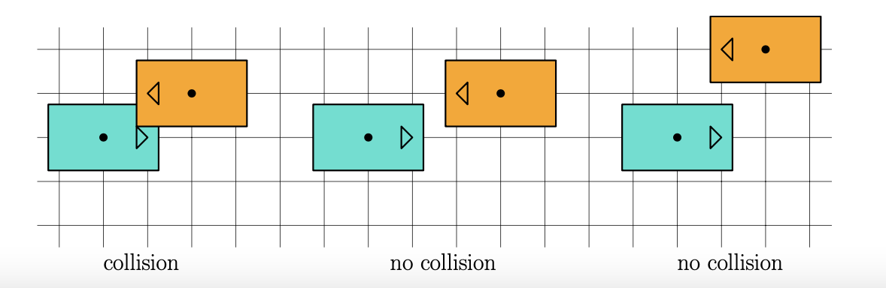
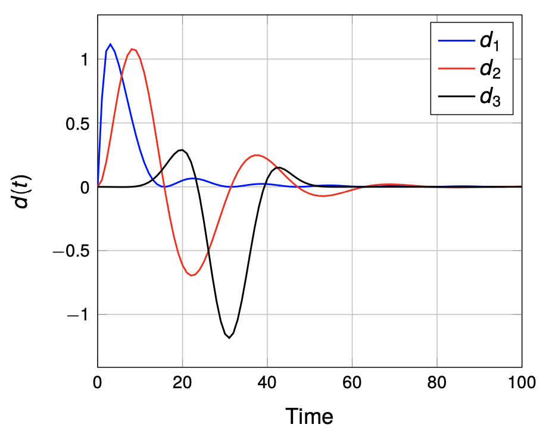
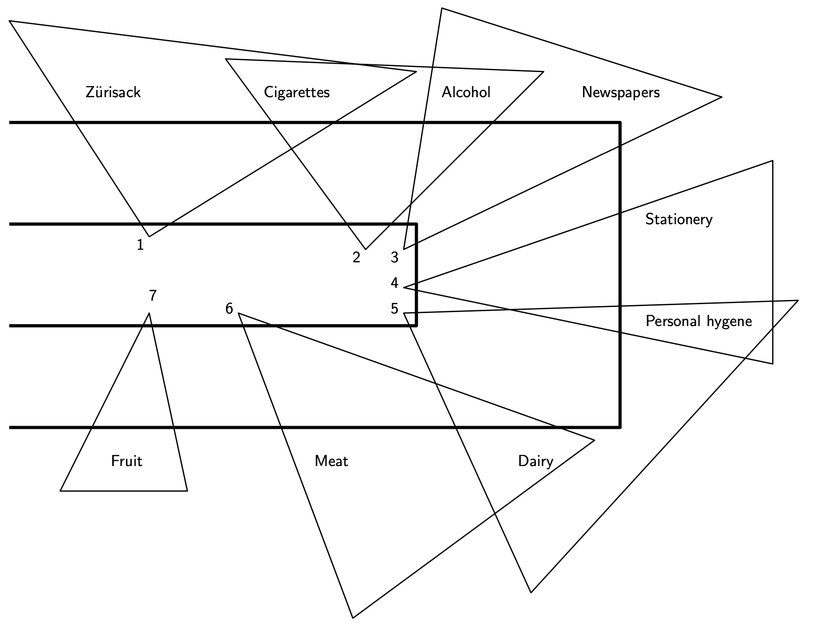
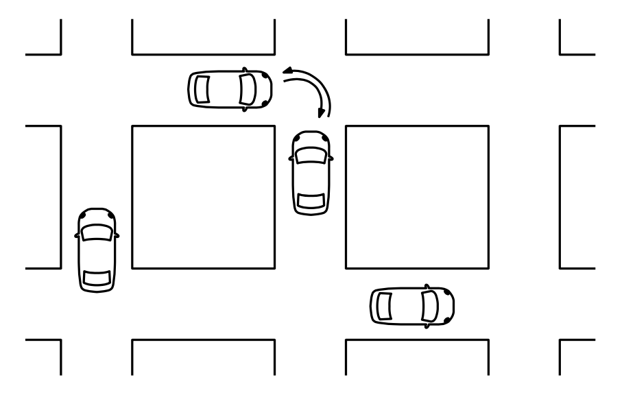

# Game Theory

This repo contains my solution for th assignments of the Game Theory course at ETH Zurich. They assignments are aimed at assessing the understanding of theretical concepts in the field of Game Theory while also require simulations in MatLab. The course cover the following topics: Nash Equilibria, Zero-Sum-Games, Potential Games, Convex Games, Auctions, Stackelberg Games, Repeated and Feedback Games, Dynamic Games.

## Homework 1
<table>
  <tr>
    <td>
      The first homework consist of three tasks:
      
 1) Many Nash Equilibria: given two game matrices, we are asked to find all Nash Equilibria (pure and mixed) of the game.
      
 2) Robust Tuning of an active dumper: we are asked to study a control problem by modelling it as a zero-sum game. We also simulate the outcome of the game with MatLab.
      
 3) Trajectory planning game: in a simplified autonomous car driving scenario, we study the game two cars play when driving in opposite directions. By modelling the problem in game-theoretical fashion, we conclude that not all the Nash Equilibria minimize the Price of Stability.
    </td>
    <td>
       &nbsp;&nbsp;&nbsp;&nbsp;&nbsp;&nbsp;&nbsp;&nbsp; 
    </td>
  </tr>
</table>

## Homework 2
<table>
  <tr>
    <td>
      The second homework consist of two tasks:
      
 1) Demand-Side Management Game: we are asked to model and study the Demand-Side-Management game, in which N energy consumers aim at minimizing the local energy consumption costs. Each player shall choose its energy consumption profile over the following 24 hours. The energy consumption at each hour has an upper limit. Moreover, the cumulative consumption over the 24 hours must satisfy the player’s (cumulative) nominal energy need. It turns out these conditions define a convex game with a unique Nash Equilibrium. We are asked to ssess the existence and uniqueness of Nash equilibria for this gam and to simulate the game with MatLab.
      
 2) Security cameras: consider the problem of deciding how to cycle through surveillance cameras in a supermarket in order to minimize theft. In this task we are asked to analyze the game played between thieves and securities in a supermarket. In our analysis, it turns out that it maybe convenient for the security to disclose their defensive strategy, as the Nash Equilibria of the Stackelberg game are more convenient than those of the Nash Equilibria.
    </td>
    <td>
       
    </td>
  </tr>
</table>

## Homework 3
<table>
  <tr>
    <td>
      The thirs homework consist of a unique task:
      
 1) Karma Game: we are again exploring the world of autonomous driving:  in particular, we focus on the scenario where pairs of cars arrive at the same time at an intersection. A mechanism is needed in order to decide which of the two cars goes first, and which one yields. This mechanism needs to be used at every intersection, every time a pair of cars arrive simultaneously. To study the problem via game theory, we consider each car a player, which has a preference for going first. More precisely, yielding comes with a cost that depends on whether the driver is in a rush or not. We are asked to analyze and optimize a token protocol in order to optimize the social cost, by leveraging the payments on the players and possible taxes.
    </td>
    <td>
       
    </td>
  </tr>
</table>
